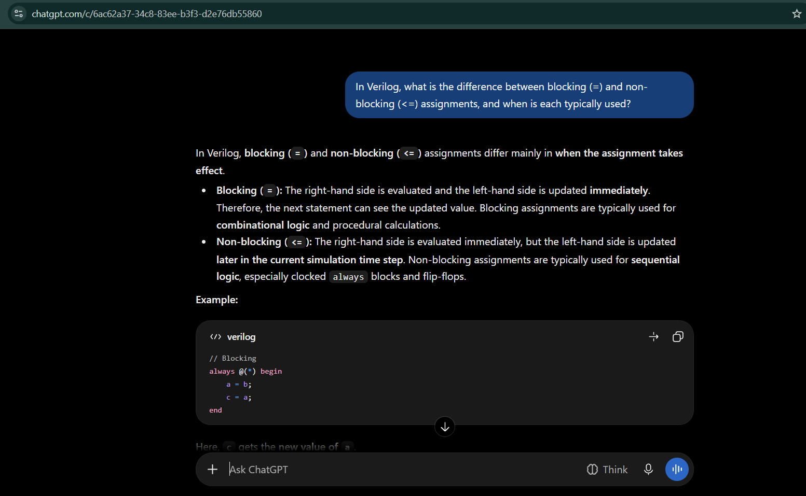
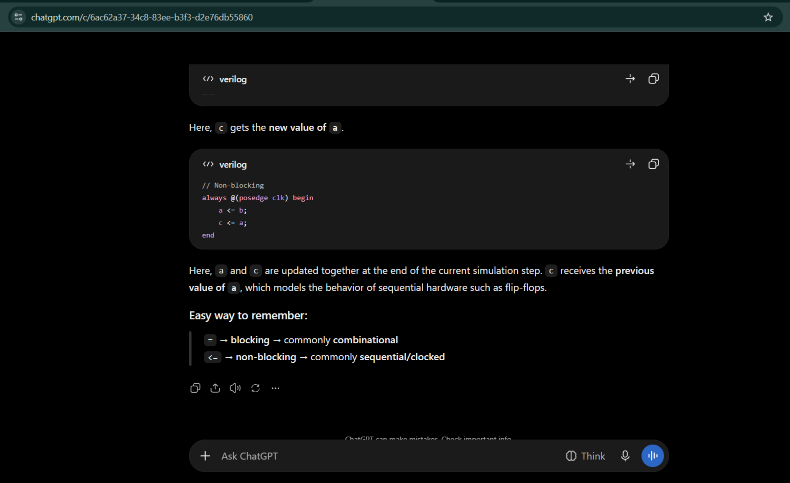
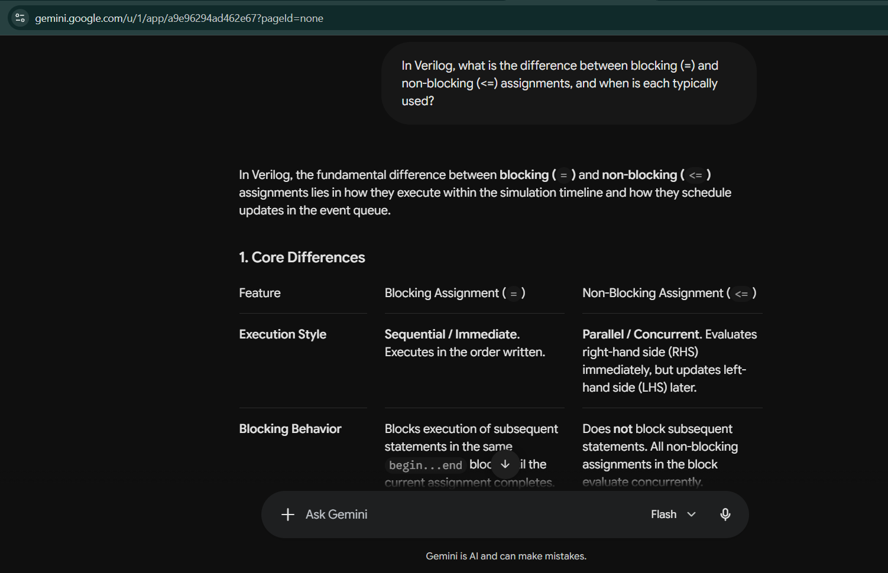
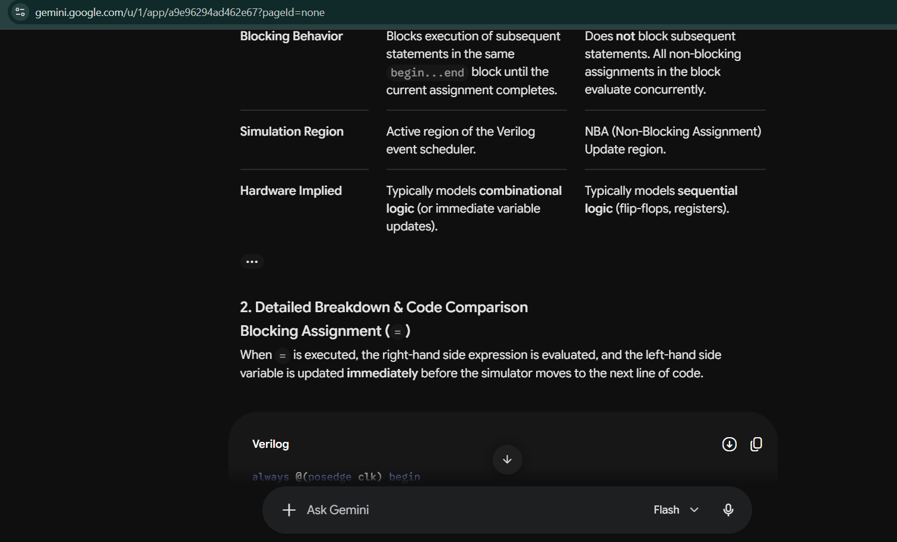
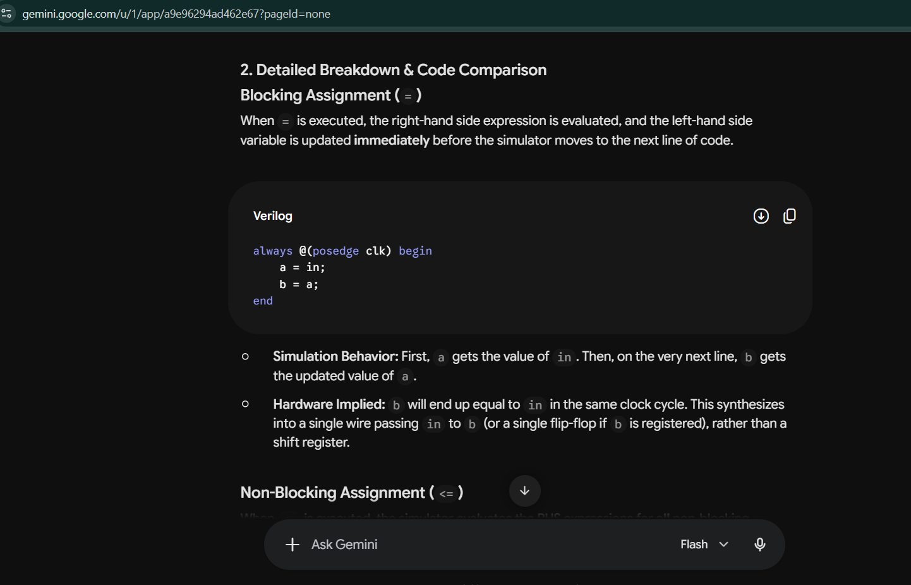
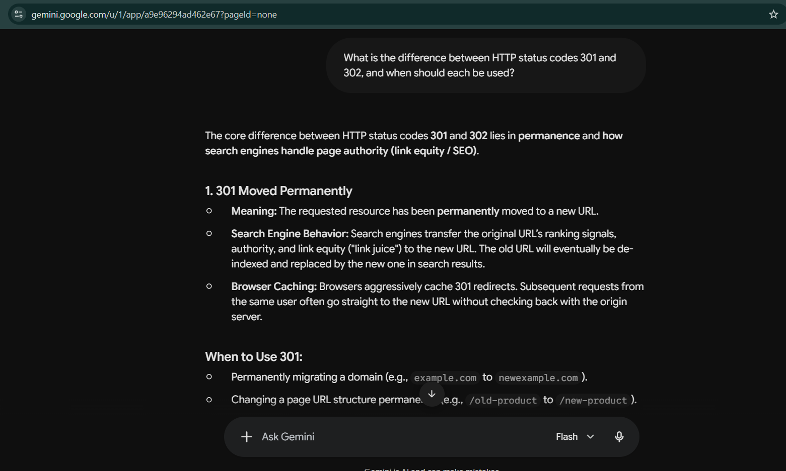
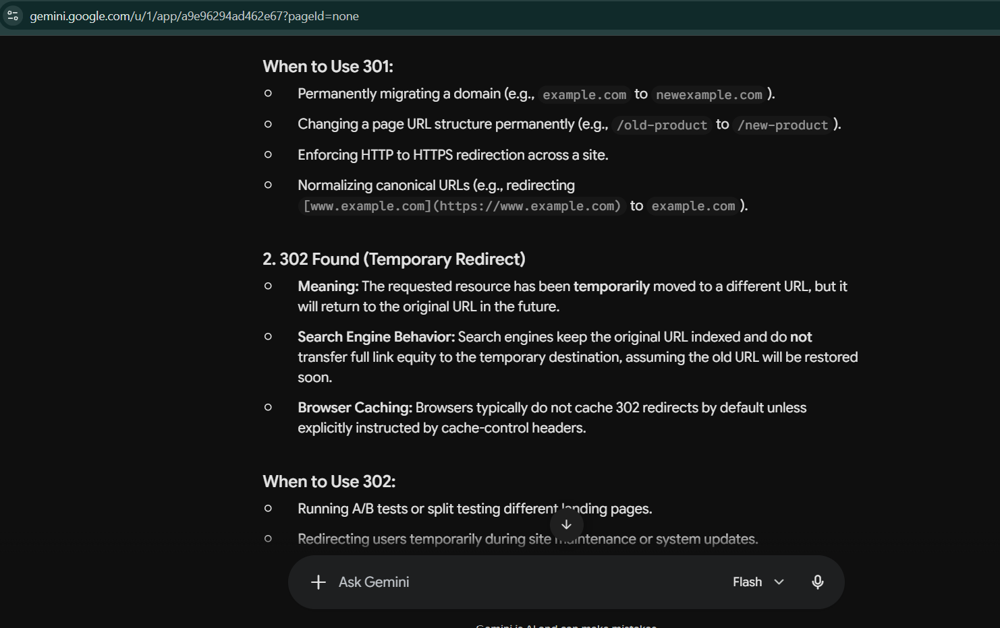
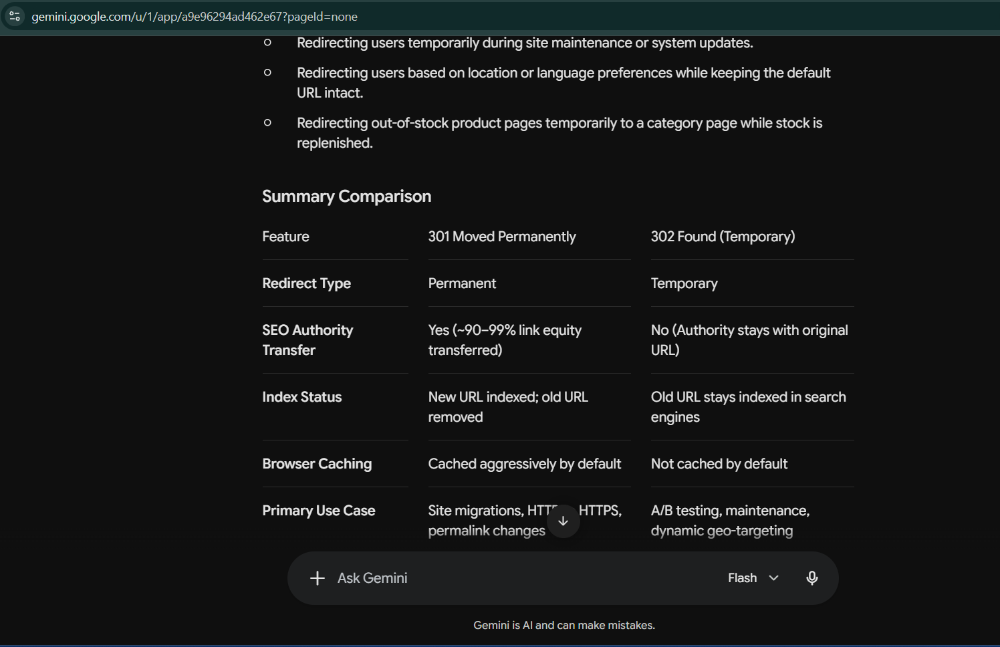

## Q1 - AI → ML → Deep Learning → Generative AI → Agents

### A - Answer

**1. Definitions **

- **Artificial Intelligence (AI):** The broad field of building computer systems that can do tasks that normally need human intelligence, like understanding information, recognizing patterns, making decisions, and solving problems.
- **Machine Learning (ML):** A subset of AI where a system learns patterns from data and uses them to make predictions or decisions, instead of relying only on hand-written rules.
- **Deep Learning (DL):** A type of ML that uses neural networks with many layers to learn complex patterns from data such as images, audio, and text.
- **Generative AI (GenAI):** AI, mostly built on deep learning, that creates new content (text, images, audio, video, code) based on patterns learned from data.
- **AI Agent:** An AI system, usually built around a model like an LLM, that can understand a goal, plan steps, use tools, remember context, and take actions to achieve that goal.

**2. Concept map**

```
+-------------------------------------------------------------+
| Artificial Intelligence (AI)                                |
|  +-------------------------------------------------------+  |
|  | Machine Learning (ML)                                 |  |
|  |  +-------------------------------------------------+  |  |
|  |  | Deep Learning (DL)                              |  |  |
|  |  |  +-------------------------------------------+  |  |  |
|  |  |  | Generative AI (GenAI)                     |  |  |  |
|  |  |  +-------------------------------------------+  |  |  |
|  |  +-------------------------------------------------+  |  |
|  +-------------------------------------------------------+  |
+-------------------------------------------------------------+

AI Agent (system / workflow, not a layer above)
  = AI model (often GenAI/LLM) + tools + memory + action loop
  -> works toward a goal
```

Note: I did not place agents inside the hierarchy. AI, ML, DL and GenAI are nested categories of techniques. An agent is a system design that *uses* a model inside a workflow.

**3. Everyday examples**

| Term | Everyday example |
|---|---|
| AI | A voice assistant understanding a spoken command and responding |
| ML | An email spam filter learning to spot spam from past emails |
| Deep Learning | Face unlock on a smartphone |
| Generative AI | ChatGPT or Gemini drafting an email from a short prompt |
| AI Agent | A travel assistant that searches flights, checks my calendar, compares options, and asks me to confirm before booking |

**4. Relationship and key difference**

AI is the broad field, ML is the approach of learning from data, and deep learning is a powerful kind of ML that uses many-layered neural networks. Generative AI uses those networks to create new content. A generative model takes a prompt and produces an output, and its job ends there. An agentic system wraps a model in a loop where it plans, calls tools, looks at the results, and keeps going until the goal is done. So a generative model produces content, while an agent uses it to decide and act, which is why agents need more careful human oversight.

### E-Evidence 

1. IBM Research, "What is generative AI?": https://research.ibm.com/blog/what-is-generative-AI
- Supports: generative AI refers to deep-learning models that generate content (text, images, code) based on the data they were trained on.
2. Google Cloud, "Generative AI use cases and definition": https://cloud.google.com/use-cases/generative-ai
- Supports: GenAI creates new content (text, images, audio, video) by learning patterns from existing data.
3. Anthropic, "Building effective agents": https://www.anthropic.com/engineering/building-effective-agents
- Supports: an agent is a system where an LLM directs its own process and tool use, which is different from a fixed workflow or a single model call.

### V - Verification

I compared my definitions against the sources above. They agree that ML is a subset of AI and DL is a subset of ML. For agents, the sources describe them as systems where a model uses tools and acts in multiple steps, which matches treating them as a workflow concept instead of a layer in the hierarchy. I rewrote all definitions in my own words and used an AI assistant (Claude) only to help structure and draft, then checked the definitions against the sources.

### R - Reflection

- **What I learned:** These terms are not interchangeable. AI, ML, DL and GenAI are nested, while an agent is a system pattern built around a model.
- **What could still go wrong:** Definitions of "agent" vary between vendors, so I should recheck with vendor-neutral sources later. Also, if the model makes a mistake in one step, an agent can act on it and the error can spread through later steps.

## Q2 - Is Everything That Looks Intelligent Actually AI?

### A - Answer

**1. Classification table**

| Example | Classification | Why |
|---|---|---|
| A. Calculator gives 25 × 16 = 400 | Traditional software (not AI) | Runs fixed, programmed arithmetic rules. It learns nothing from data and gives the same result every time. |
| B. If temperature > 80°C, display WARNING | Traditional software (not AI) | A human wrote the exact if-then rule and the 80°C threshold. The program cannot change the rule on its own. |
| C. Email system identifies spam from patterns in past emails | Machine-learning-based AI | It learns patterns from past emails instead of relying on rules written for each spam word, then classifies new emails as spam or not spam. |
| D. AI assistant summarizes a document | Generative AI | It creates new text (a summary) from the document and the user's request, instead of picking from fixed answers. |
| E. Navigation app predicts arrival time from traffic and historical data | Machine-learning-based AI | It predicts a value using patterns learned from traffic and historical data, instead of one fixed formula. |

**2. Reasoning for each case**

- **A. Calculator:** It looks smart because it is fast and always correct, but it only executes arithmetic rules a programmer wrote. Nothing is learned, so it is traditional software.
- **B. Temperature warning:** The condition and threshold are both written by a human. It behaves the same forever unless a person edits the code, so it is rule-based software, not AI.
- **C. Spam filter:** Instead of a human writing a rule for every spam pattern, the system learns from many past emails which features (words, links, sender behavior) usually go with spam. Learning from data makes it ML.
- **D. Summarizer:** A language model produces original text rather than copying stored sentences. Creating new content makes it generative AI.
- **E. Navigation ETA:** Travel time depends on many changing factors (traffic, time of day, past patterns), which are hard to cover with fixed rules. Predicting from learned patterns makes it ML.

**3. What makes an AI system different from a program that follows explicit instructions?**

In a traditional program, a human works out the problem and writes every rule in advance, so the program only does what those rules say. In an AI (machine learning) system, the human provides data and a learning method, and the system finds its own patterns that act as rules. This lets AI handle messy inputs like text, images and speech, where writing every rule by hand is not realistic. Generative AI goes a step further and uses learned patterns to create new content. So something looking intelligent does not make it AI. What matters is how the result is produced: written rules, learned patterns, or generated content.

**Caveats:** Real products often mix both. For example, a spam filter may use hand-written rules alongside a learned model, and generative AI is itself built on machine learning. I classified each case by its *primary* behavior.

### E - Evidence

1. 1. Google, *Introduction to Machine Learning*: https://developers.google.com/machine-learning/intro-to-ml
   - Supports: a short course on how solving problems with ML differs from traditional approaches.
2. Google Cloud, "Generative AI use cases and definition": https://cloud.google.com/use-cases/generative-ai
   - Supports: generative AI creates new content (text, images, audio, video) by learning patterns from existing data.
3. IBM, "AI vs. machine learning vs. deep learning vs. neural networks": https://www.ibm.com/think/topics/ai-vs-machine-learning-vs-deep-learning-vs-neural-networks
   - Supports: ML is a subset of AI that learns from data, which separates it from plain rule-following software.

### V - Verification

I classified each example by asking one question: *who or what created the rules?* In A and B, a human wrote the exact rules, so they are traditional software. In C and E, the system learned patterns from data, so they are ML-based AI. In D, the system creates new text, so it is generative AI. I checked these ideas against the sources above, which describe the same difference between hand-written rules and learning from data. I wrote the reasoning in my own words and used an AI assistant (Claude) to help structure it, then checked it against the sources.

### R - Reflection

- **What I learned:** Not every automated or clever feature is AI. A calculator and a threshold warning can look smart but only follow fixed rules. The difference is whether the rules are written by a human or learned from data.
- **What could still go wrong:** I can't see inside real products, so labeling C and E as ML is based on how such systems typically work, not on proof from their makers. Also, using AI where simple exact rules would do (like a calculation) adds unnecessary error and cost.

## Q3 - What Happens When You Ask an LLM a Question?

### A - Answer

**1. What happens after you submit a prompt (intuitive view)**

An LLM does not "think" like a human, and it does not look up answers in a database of facts. When you submit a prompt, the model first breaks your text into small pieces called tokens. It processes these tokens together with the available context and calculates a probability for each possible next token. It then selects one token, adds it to the sequence, and repeats this step again and again until the response is complete. This repeated process is called next-token prediction, and it is the basic mechanism behind how LLMs generate text.

**2. Important terms**

- **Prompt:** The text, question, or instruction the user gives to the model.
- **Token:** A small unit of text the model works with. It can be a whole word, part of a word, punctuation, or another piece of text. (For efficiency, models do not always use whole words, so a long or rare word may be split into smaller pieces.)
- **Context:** Everything the model can consider at once when predicting the next token: the user's prompt, any instructions, the earlier conversation, and the tokens it has already generated.
- **Probability:** A number showing how likely each possible next token is, according to the model.
- **Next-token prediction:** Using the tokens and context so far to predict which token should come next, adding it to the text, and repeating.
- **Generated response:** The final sequence of tokens produced by repeating this process until the model reaches a stopping point, converted back into readable text.

**Training vs inference:** Training is when the model learns patterns from a huge amount of text data and its parameters are updated. Inference is when the already-trained model receives a new prompt and uses what it learned to generate a response; its parameters are not changed while it answers.

**3. Flow diagram (annotated)**

```
User Prompt            e.g. "The capital of France is"
     ↓
   Tokens              text is split into small pieces (tokens)
     ↓
Model Processing       model looks at the tokens + context
     ↓
Probability            model scores every possible next token
Distribution           (illustrative: "Paris" high, "Lyon" low, "London" very low)
     ↓
Next Token Selection   one token is chosen and added to the text
     ↓
Generated Response     tokens are turned back into readable text
     ↑
     └──── steps repeat for each new token until the model stops
```

**Example:** For the prompt "The capital of France is", the model may give a high probability to "Paris". After choosing a token, it adds it to the context and predicts the next token again. Repeating this builds the full response.

**4. Why can an LLM sound fluent but still be wrong?**

An LLM is mainly trained to learn patterns in language and predict likely next tokens. That makes it very good at producing text that is grammatical, coherent and convincing. But predicting what *sounds* right next is not the same as checking whether a statement is true. So the model can write a confident, well-structured sentence even when the facts in it are unsupported or wrong. A fluent answer should never be treated as a verified answer.

### E - Evidence

1. Hugging Face, LLM Course, "Deep dive into Text Generation Inference with LLMs": https://huggingface.co/learn/llm-course/chapter1/8
   - Supports: the model generates one token at a time, calculates probabilities for the possible next tokens, and then selects one.
2. labuladong, "How LLMs Predict the Next Token": https://labuladong.online/en/ai-coding/basics/llm-token-prediction/
   - Supports: the model predicts a probability for the next token given the text so far, picks one, appends it, and loops until it emits a "done" token. It also explains that the trained parameters stay fixed when you run your input through them (inference).

### V - Verification

I checked my explanation against the two sources above. Both describe the same process I wrote: the text is split into tokens, the model predicts probabilities for the next token, one token is chosen and added to the text, and this repeats until a stop signal. Source 1 also covers how models are trained, and Source 2 explains that the parameters are fixed during inference, which matches my training vs inference definition. One simplification to note: I wrote that the selected token is often the most likely one, but real systems can also sample from the probabilities, so the choice is not always the single top token. I wrote the explanation in my own words and used an AI assistant (Claude) to help structure and draft it, then checked it against these sources.

### R - Reflection

- **What I learned:** An LLM does not retrieve a ready-made answer from a database. It builds the response one token at a time by predicting what comes next from the context. This explains why an answer can sound confident and fluent while still containing mistakes. Fluency measures how good the language is, not whether the facts are true.
- **What could still go wrong:** I might mistake a confident, well-written explanation for a correct one and skip checking it. My explanation is also simplified, since I did not cover how the model actually processes tokens internally (that comes in later weeks), so some details may be refined later.

## Q4 - Hallucination Experiment: Can AI Sound Confident and Still Be Wrong?

### A - Answer

#### Experiment Question

> In Verilog, what is the difference between blocking (`=`) and non-blocking (`<=`) assignments, and when is each typically used?

#### AI Assistant 1 - ChatGPT

In Verilog, blocking (`=`) and non-blocking (`<=`) assignments differ mainly in when the assignment takes effect.

* Blocking (`=`): The right-hand side is evaluated and the left-hand side is updated immediately. Therefore, the next statement can see the updated value. Blocking assignments are typically used for combinational logic and procedural calculations.
* Non-blocking (`<=`): The right-hand side is evaluated immediately, but the left-hand side is updated later in the current simulation time step. Non-blocking assignments are typically used for sequential logic, especially clocked `always` blocks and flip-flops.

Example:

```verilog
// Blocking
always @(*) begin
    a = b;
    c = a;
end
```

Here, `c` gets the new value of `a`.

```verilog
// Non-blocking
always @(posedge clk) begin
    a <= b;
    c <= a;
end
```

Here, `a` and `c` are updated together at the end of the current simulation step. `c` receives the previous value of `a`, which models the behavior of sequential hardware such as flip-flops.

Easy way to remember:
`=` → blocking → commonly combinational
`<=` → non-blocking → commonly sequential/clocked

#### AI Assistant 2 - Gemini

In Verilog, the fundamental difference between blocking (=) and non-blocking (<=) assignments lies in how they execute within the simulation timeline and how they schedule updates in the event queue.

**1. Core Differences**

| Feature | Blocking Assignment (=) | Non-Blocking Assignment (<=) |
|---|---|---|
| Execution Style | Sequential / Immediate. Executes in the order written. | Parallel / Concurrent. Evaluates right-hand side (RHS) immediately, but updates left-hand side (LHS) later. |
| Blocking Behavior | Blocks execution of subsequent statements in the same begin...end block until the current assignment completes. | Does not block subsequent statements. All non-blocking assignments in the block evaluate concurrently. |
| Simulation Region | Active region of the Verilog event scheduler. | NBA (Non-Blocking Assignment) Update region. |
| Hardware Implied | Typically models combinational logic (or immediate variable updates). | Typically models sequential logic (flip-flops, registers). |

**2. Detailed Breakdown & Code Comparison**

Blocking Assignment (=)

When = is executed, the right-hand side expression is evaluated, and the left-hand side variable is updated immediately before the simulator moves to the next line of code.

```verilog
always @(posedge clk) begin
    a = in;
    b = a;
end
```

Simulation Behavior: First, a gets the value of in. Then, on the very next line, b gets the updated value of a.

Hardware Implied: b will end up equal to in in the same clock cycle. This synthesizes into a single wire passing in to b (or a single flip-flop if b is registered), rather than a shift register.

Non-Blocking Assignment (<=)

When <= is executed, the simulator evaluates the RHS expressions for all non-blocking statements in the block using the current state of variables. However, it delays updating the LHS variables until the end of the current time step (the NBA update region).

```verilog
always @(posedge clk) begin
    a <= in;
    b <= a;
end
```

Simulation Behavior: At the clock edge, the current value of in is sampled for a, and the old value of a (before the clock edge) is sampled for b. After evaluating both lines, both a and b are updated simultaneously.

Hardware Implied: Synthesizes into a 2-stage shift register (two flip-flops in series).

**3. Recommended Rules of Usage (Clifford Cummings Guidelines)**

To avoid synthesis-simulation mismatches and race conditions in Verilog, follow these standard coding guidelines:

1. Use non-blocking assignments (<=) when modeling sequential logic inside edge-triggered always @(posedge clk) or always @(negedge clk) blocks.
2. Use blocking assignments (=) when modeling combinational logic inside always @(*) or always @(a or b) blocks.
3. Use non-blocking assignments (<=) when modeling mixed sequential/combinational logic in the same clocked always block.
4. Use blocking assignments (=) inside assign statements (implicit via continuous assignment syntax assign out = a & b;).
5. Do not mix blocking and non-blocking assignments in the same always block.
6. Do not make assignments to the same variable from more than one always block.

### E - Evidence

| Prompt | Model | Response summary | Verified claim | Evidence | Result | Lesson |
|---|---|---|---|---|---|---|
| Same question (above) | ChatGPT | `=` updates immediately, `<=` updates later in the time step; `=` for combinational, `<=` for clocked logic; two short examples | `<=` for sequential logic, `=` for combinational | Cummings, SNUG 2000 | Correct but incomplete (no race conditions, no rule against mixing styles) | A short answer can be correct and still leave out important rules |
| Same question | Gemini | Same core idea, plus a table, scheduler regions, a shift-register example, and six "Cummings guidelines" | `=` combinational, `<=` sequential; do not mix in one block; one variable per always block | Cummings, SNUG 2000 | Correct | Detail is not the same as accuracy |
| Same question | Gemini | Listed using blocking assignments "inside `assign` statements" as a guideline | `assign` uses blocking assignments | Cummings, SNUG 2000; `assign` is a continuous assignment | Wrong or imprecise; not found in the guidelines I checked | Check each item an AI attributes to a named source |
| Same question | Gemini | Said a blocking assignment in a clocked block "synthesizes into a single wire" (then "or a single flip-flop") | Blocking assignment in a clocked block becomes a wire | Cummings, SNUG 2000 | Imprecise and self-contradictory | Hardware claims need a source or a test |

**Screenshots (unedited apart from cropping):**







Reference: Clifford Cummings, "Nonblocking Assignments in Verilog Synthesis, Coding Styles That Kill!" (SNUG San Jose 2000): https://rfsoc.mit.edu/6S965/_static/F24/lectures/CummingsSNUG2000SJ_NBA.pdf

### V - Verification

I compared the important claims from both AI responses with the Cummings paper. Both tools agreed on the main idea: blocking assignments update immediately, non-blocking assignments evaluate the right side first and update the left side later in the same time step, and non-blocking is the usual choice for sequential logic while blocking is the usual choice for combinational logic. ChatGPT was correct on these points but did not mention race conditions or the rule against mixing the two styles. Gemini was more detailed and was also correct on the guidelines for sequential logic, combinational logic, not mixing both styles in one block, and not assigning a variable from more than one always block. However, Gemini listed `assign` statements as a place to use blocking assignments, which is wrong or imprecise because `assign` is a continuous assignment, and I could not find that item in the guidelines I checked even though Gemini labeled the whole list as Cummings' guidelines. Gemini's statement that a blocking assignment in a clocked block becomes "a single wire" was also imprecise and confusing. The two answers did not directly contradict each other, but Gemini's extra detail is where the problems appeared.

### R - Reflection

This experiment showed me that an AI response can sound convincing because it can produce clear and technically structured language even when a claim has not been verified. Gemini's answer looked more complete and professional than ChatGPT's, yet it contained a wrong or imprecise claim and a confusing one, hidden among many correct statements. Therefore, confidence, detail and fluency are not enough to establish that an AI-generated technical answer is correct. I should check important technical claims against reliable sources before accepting them, especially when an answer attributes its points to a named source.

> Note: I chose this question because it has a clear answer in a published paper that I could check. I know it uses hardware-description terminology, but the concept (when an assignment takes effect) is a general programming-semantics question.

## Q5 - AI Assistant vs Search vs Authoritative Reference

### A - Answer

#### Common question (same for all three methods)

> What is the difference between HTTP status codes 301 and 302, and when should each be used?

#### Comparison table

| | AI assistant | Web search | Authoritative reference |
|---|---|---|---|
| Source used | Gemini | Source 1: seoClarity, "When to Use a 301 Redirect vs. 302 Redirect" (June 30, 2020): https://www.seoclarity.net/resources/knowledgebase/use-301-redirect-vs-302-redirect-15683/. Source 2: BigRock blog on 301 and 302 redirects: https://www.bigrock.in/blog/products/websites-products/301-and-302-redirects-understanding-their-differences-and-when-to-use-them. Source 3: Tangence Solutions (SEO agency), "301 vs 302 Redirects: What's the Difference and Which Should You Use?" (September 15, 2026): https://www.tangence.in/blog/301-vs-302-redirect/ | RFC 9110, HTTP Semantics, sections 15.4.2 (301) and 15.4.3 (302): https://www.rfc-editor.org/rfc/rfc9110.html |
| What it said | 301 is permanent and 302 is temporary. 301 passes SEO authority (~90-99%) and is cached strongly. 302 keeps the old URL indexed and is not cached by default. Gave examples and a summary table. | All three agree 301 is permanent and 302 is temporary, and list uses like site moves, A/B tests and maintenance. They focus on SEO and disagree on how much link value passes. | 301 means moved permanently and 302 means "Found" (temporary). On 301 and 302 a user agent may change POST to GET. 307 and 308 are the versions that keep the method. It says nothing about SEO. |
| Accuracy | Main meaning correct; some details unsupported | Main meaning correct; SEO claims conflict | Highest, it defines the codes |
| Explanation | Very clear, with examples and a table | Practical, but written from an SEO point of view | Exact but hard to read |
| Traceability | None, it gave no sources | Medium, I can see the website, but they are companies and may copy each other | Strong, exact document and section |
| Ease of verification | Hard without another source | Medium | It is what I verify against |

**Differences I found:**

1. Gemini never mentioned that POST may change to GET on 301/302, or that 307 and 308 exist to keep the method.
2. Gemini wrote "302 Found (Temporary Redirect)". In the standard, 302 is "Found" and "Temporary Redirect" is the name of 307.
3. Gemini's "~90-99% link equity" figure has no source. The RFC does not cover SEO, and the web sources do not agree on the number.
4. The web sources contradict each other about 302. One says a 302 does not pass link value, and another says it should have no impact on PageRank.
5. None of the web sources mention the RFC, POST-to-GET changes, or 307/308. They answer the SEO version of the question, not the protocol version.

### E - Evidence

- AI answer: Gemini (screenshot saved in `week-01/evidence/`)
- Search results: Source 1 (seoClarity): https://www.seoclarity.net/resources/knowledgebase/use-301-redirect-vs-302-redirect-15683/ ; Source 2 (BigRock): https://www.bigrock.in/blog/products/websites-products/301-and-302-redirects-understanding-their-differences-and-when-to-use-them ; Source 3 (Tangence Solutions): https://www.tangence.in/blog/301-vs-302-redirect/
- Authoritative reference: RFC 9110, sections 15.4.2 and 15.4.3: https://www.rfc-editor.org/rfc/rfc9110.html

- AI answer: Gemini (screenshots below)




### V - Verification

I asked the same question to Gemini, searched the web and read three results, then checked all of them against RFC 9110. The basic meaning (301 permanent, 302 temporary) was the same everywhere. What did not hold up was Gemini's "~90-99%" link equity number (not in the RFC, and the web sources disagree on it), its naming of 302 as "Temporary Redirect", and its missing POST-to-GET and 307/308 points. The web sources also contradicted each other about whether a 302 passes link value.

### Final conclusion: when to use each method

- **AI assistant:** Best for a quick, clear overview and for ideas on where to look next. It is fast, but I can't trace where its facts come from, and it can give exact-looking numbers without a source. I use it as a starting point, not proof.
- **Web search:** Best for finding sources, examples and different opinions. I can see who wrote it, but many pages are written by companies selling a service and they can disagree, so I check the claims behind them.
- **Authoritative reference:** I need this when a mistake would cost something real, such as security, safety, money, legal or standards compliance, or anything hard to undo. I also need it when the AI and search disagree, or when I must know exactly what a standard says. For this question, I would read the RFC before setting up redirects on a real website.

### R - Reflection

This showed me that a clear, confident answer can still contain details that no source supports, like the exact link equity percentage. It also showed me that search results are not automatically proof, because three pages disagreed on the same point. The best way was to use the AI and search to understand the topic, then use the RFC to settle what is actually defined. What could still go wrong: I only read three web pages, and the RFC covers the protocol but not how search engines behave, so for the SEO part I still depend on weaker sources.

## Q6 - What Is an AI Agent?

### A - Answer

**1. Five ideas in my own words**

| Concept | What it is (my words) | What it adds | Simple example |
|---|---|---|---|
| **LLM** (Large Language Model) | A model trained on a huge amount of text that can understand and generate human-like language by predicting likely next tokens. | The language ability itself | The model behind a chat assistant |
| **LLM application** | Software that uses an LLM as one component, with an interface, instructions and formatting, to give users a useful function. | A product around the model | A summarizer app or a customer-support chatbot |
| **RAG system** (Retrieval-Augmented Generation) | A system that first searches an external source (documents, a knowledge base) for relevant information and gives it to the LLM, so the answer can use that information. | Access to information beyond the model's training data | A company help bot that looks up the policy document before answering |
| **Tool-using assistant** | An AI system that can call external tools or services (calculator, search, database, API) when it needs to do something or get information. | The ability to act or fetch data | An assistant that uses a calculator or weather service |
| **AI agent** | A system built around an AI model that works toward a goal: it decides what action to take, uses a tool, checks the result, and continues until the goal is reached. | A decision loop (act, observe, decide next step) | A travel assistant that searches, compares and builds a plan |

**2. Architecture diagram**

```
User request
     │
     ▼
AI / LLM model  ◄──────────────────────────────┐
(plans, decides what to do next)               │
     │                                         │
     ▼                                         │
Tool call (search, API, calculator, database)  │
     │                                         │
     ▼                                         │
Tool result ───────────────────────────────────┘
     │            (model reads the result and decides:
     │             need another tool call? or done?)
     ▼
Decision: goal reached?
     │
     ├── No  → another tool call (loop back to the model)
     └── Yes → Final response to the user
```

The important idea is that the result of one action is fed back to the model, which uses it to decide the next step.

**3. What makes an agent different from a simple chatbot?**

| | Simple chatbot | AI agent |
|---|---|---|
| Main behavior | Takes a message and generates a reply | Works toward a goal over several steps |
| Tools | Usually none, or fixed | Chooses which tools to use as needed |
| Flow | One question, one answer | Loop: act, observe the result, decide the next step |
| Handling problems | Usually needs the user to point out an error | Can notice a failed or unexpected tool result and try another approach |

Easy way to remember: a chatbot mainly *answers*. An agent can *decide, act, check and continue*. A tool-using assistant sits in the middle: it can use tools, but it may follow a fixed path, while an agent decides its own path.

**4. Non-VLSI example of an agentic workflow**

**Travel-planning agent.** User: "Plan a 3-day trip to Hyderabad within my budget."

```
Understand the goal and the budget
        ↓
Tool call: search hotels  →  result
        ↓
Tool call: search transport  →  result
        ↓
Compare prices against the budget
        ↓
Over budget? → search cheaper options (loop back)
        ↓
Within budget → organize and present the travel plan
```

It is agentic because the system uses different tools, reads each result, and uses it to decide what to do next, until the goal (a plan within budget) is met. For something with real consequences, like booking and paying, a human should confirm before the agent acts.

### E - Evidence

1. Anthropic, "Building effective agents": https://www.anthropic.com/engineering/building-effective-agents
   - Supports: the difference between workflows (fixed, predefined paths) and agents (the model directs its own process and tool use), and an LLM extended with retrieval and tools.
2. IBM Research, "What is retrieval-augmented generation?": https://research.ibm.com/blog/retrieval-augmented-generation-RAG
   - Supports: RAG grounds an LLM on external knowledge, in two phases (retrieval, then generation).
3. Hugging Face, Agents Course, "What are LLMs?": https://huggingface.co/learn/agents-course/unit1/what-are-llms
   - Supports: what an LLM is and how it generates text one token at a time.

(Accessed: October 2026)

### V - Verification

I checked my five definitions against the sources above. IBM's page matches my RAG definition: the system retrieves relevant information first and then the LLM generates the answer from it. The Hugging Face page matches my LLM definition. Anthropic's article supports the main distinction in my answer: a fixed workflow follows a predefined path, while an agent is a system where the model decides its own steps and tool use, which is why I placed the tool-using assistant between a chatbot and an agent. I focused on system behavior and not on any one vendor's wording. One thing I adjusted: IBM notes that RAG is imperfect, so I did not claim that RAG guarantees accurate answers. I wrote everything in my own words and used an AI assistant (Claude) to help structure and draft, then checked it against these sources.

### R - Reflection

- **What I learned:** An LLM is a model, while an LLM application, a RAG system, and an agent are larger systems built around a model. RAG gives a model access to retrieved information, tool use lets a system interact with outside services, and an agent combines these into a loop that works toward a goal.
- **What could still go wrong:** An agent can get stuck repeating the same tool call, or make a wrong decision in one step and then build further actions on top of that mistake. Because it can act and not just talk, it needs limits, logs, and human approval for important actions. Also, the word "agent" is used differently by different vendors, so I should keep checking neutral sources.

## Q7 - Where Should Humans Still Make the Decision?

### A - Answer

An AI assistant can read documents, answer questions, summarize, write text and suggest actions. It can still be wrong, miss context, or make things up in a confident tone, so a human must stay responsible for any decision that matters.

| # | Situation | Possible failure if accepted without checking | Required verification | Who/what approves |
|---|---|---|---|---|
| 1 | AI gives medical or health advice (e.g., a medicine or dosage) | Wrong, outdated or unsafe advice that harms the person | Check the official source (the medicine label, a health authority) and ask a qualified professional | Doctor or pharmacist |
| 2 | AI summarizes a contract or cites laws and past cases | Misses or invents a clause, or cites a case or rule that does not exist | Read the original document and look up every citation in the real source | Lawyer or legal team |
| 3 | AI prepares a financial report or recommends a payment | Wrong numbers, wrong calculation, or paying the wrong person or amount | Recalculate from the source data and compare against records | Accountant or finance manager |
| 4 | AI drafts an email or message and could send it on my behalf | Wrong facts, wrong tone, wrong recipient, or sharing private information | Read the full message and check names, facts and attachments before sending | Me (the sender) |
| 5 | AI writes code or settings that will go into a real system | Bugs or security holes; a change that breaks something | Run tests, check the logic, and have a second person review it | Reviewing engineer or team lead |

**Evidence I would want before trusting an AI recommendation:**
- A source I can open (official document, standard, label or original file), not just the AI's word
- A second independent source that agrees
- A result I can test myself (recalculate a number, run the code, compare with the original)
- A clear record of what the AI was given and what it produced

**Simple rule for responsible AI-assisted work:** AI can draft and suggest, but a human who is accountable must verify and approve anything that matters. The higher the cost of being wrong, or the harder it is to undo, the stronger the check should be.

### E - Evidence

- Anthropic, "Building effective agents": https://www.anthropic.com/engineering/building-effective-agents
  - Supports: AI systems that act on their own should include human checkpoints and stopping points, instead of running with no oversight.
- Real-world example of skipping verification: LawNext, "Court imposes sanctions on lawyers who filed bogus cases after relying on ChatGPT for legal research" (June 2023): https://www.lawnext.com/2023/06/court-imposes-sanctions-on-lawyers-who-filed-bogus-cases-after-relying-on-chatgpt-for-legal-research.html
  - Supports: situation 2. In *Mata v. Avianca*, lawyers submitted a brief with fake case citations generated by ChatGPT, and the court fined them $5,000. The judge said lawyers have a "gatekeeping role" to make sure their filings are accurate.

### V - Verification

I chose situations where a wrong AI output can cause real harm and where I can name a human who is accountable. For each one I checked that the verification step uses an independent source or test (the original document, official label, recalculation or test run), not another AI answer. I compared my rule against the source above about human oversight and the real-world example. I wrote the answer in my own words and used an AI assistant (Claude) to help structure it, then checked it against these sources.

### R - Reflection

- **What I learned:** AI is useful for drafting and explaining, but responsibility cannot be handed to it. What decides how much checking is needed is how costly and how reversible a mistake would be.
- **What could still go wrong:** I might skip checking when an answer looks polished, or trust a quick review that misses details. A human reviewer can also get lazy if the AI is right most of the time, so the checking habit has to be deliberate.

## Q8 - Find AI Around You

### A - Answer

| # | System / Feature | AI/ML involved? | Task type | Public evidence / source | Conclusion |
|---|---|---|---|---|---|
| 1 | Google Maps - ETA and traffic prediction | Yes | Prediction | [DeepMind: Traffic prediction with advanced Graph Neural Networks (2020)](https://deepmind.google/discover/blog/traffic-prediction-with-advanced-graph-neural-networks/) | AI/ML is involved. DeepMind and Google Maps describe a Graph Neural Network that predicts travel time for road segments. |
| 2 | Gmail - spam filtering | Yes | Classification | [Google Workspace Blog: Ridding Gmail of 100 million more spam messages with TensorFlow](https://workspace.google.com/blog/product-announcements/ridding-gmail-of-100-million-more-spam-messages-with-tensorflow) | AI/ML is involved. Google says it uses TensorFlow-based ML models to block additional spam. |
| 3 | YouTube - video recommendations | Yes | Recommendation (ranking / prediction) | [Covington et al., "Deep Neural Networks for YouTube Recommendations" (RecSys 2016)](https://research.google/pubs/pub45530) and [YouTube blog: On YouTube's recommendation system](https://blog.youtube/inside-youtube/on-youtubes-recommendation-system/) | AI/ML is involved. The paper describes a deep candidate-generation model and a deep ranking model. The 2016 paper may not match today's production system. |
| 4 | Gmail - Smart Compose | Yes | Generation (next-word prediction) | [Google Research Blog: Smart Compose (May 2018)](https://www.research.google/blog/smart-compose-using-neural-networks-to-help-write-emails/) and [KDD 2019 paper: Gmail Smart Compose](https://research.google/pubs/pub48231/) | AI/ML is involved. Google describes a neural language model that suggests sentence completions as you type. |
| 5 | Microwave - weight-based auto-defrost | Probably not | Deterministic calculation (my assumption) | Not enough public evidence to conclude. I could not find a reliable source describing the internal logic of a specific microwave. | Likely simple rules or a lookup table (weight in, time out), but I cannot verify this. |

### Rule-based comparison (YouTube recommendations)

A simple rule-based version could be:

```
IF user watches cricket videos  -> show the most-viewed cricket videos this week
IF user watches cooking videos  -> show the most-viewed cooking videos this week
```

This imitates a basic "more of the same" feature. YouTube's own blog says its early system ranked videos by popularity, and that today's system does not work from a fixed recipe book of rules. Hand-written rules break down when:

- tastes change over time,
- a viewer watches many different topics,
- there are billions of videos, so no developer can write rules for every pattern.

So a rule-based approach can copy a simple version of the behavior, but not personalization at scale.

### E - Evidence

- DeepMind blog on Google Maps ETA prediction (row 1)
- Google Workspace blog on Gmail spam filtering with TensorFlow (row 2)
- Covington et al. (2016) YouTube paper, and YouTube's blog on its recommendation system (row 3)
- Google Research blog and KDD 2019 paper on Smart Compose (row 4)
- Row 5: no reliable public source found

### V - Verification

- I opened all six links on 7 October 2026 and checked that each page supports the claim in the table. Google Maps: Graph Neural Network for ETAs. Gmail: TensorFlow ML models for spam. YouTube paper: deep candidate generation and ranking models. Smart Compose: neural language model for suggestions.
- Three links suggested by an AI tool were wrong or outdated (Gmail spam, YouTube paper, Smart Compose blog). I searched for each source and replaced it with the working URL.
- I preferred official company engineering and research pages over news articles.
- I did not accept that a feature is AI just because it feels "smart".
- Company posts can be outdated or simplified. They confirm that ML is used, but not exactly how.
- For the microwave I found no evidence, so I wrote "Not enough public evidence to conclude" instead of guessing.
- AI assistants suggested the examples. I removed claims I could not source (for example, citations to "user manuals").

### R - Reflection

Many features are called "smart" or "AI-powered" even when ordinary rules would do the job. The clear evidence for AI came from products whose companies published papers or engineering posts. The microwave showed me that a feature can look intelligent while I still have no proof of how it works. A corrected link also taught me that AI tools can give plausible but wrong URLs. What could still go wrong: an older source may not describe the current system, and I may wrongly label something "AI" or "rule-based" without evidence. Next time I will check each source's date and separate "the company says ML is used" from "I know how it works".

## Q9 - Prediction, Classification, and Generation

### A - Answer

| # | Example | Primary task | Reason | Caveat |
|---|---|---|---|---|
| A | Predicting house prices | Prediction (regression) | The output is a number (an expected price) estimated from features such as size and location. | "Prediction" is also used loosely for all ML outputs. Here it means estimating a numeric value. |
| B | Detecting whether an image contains a cat | Classification | The output is a category: cat or no cat. | A system that also draws a box around the cat adds object detection. |
| C | Writing an email from a short instruction | Generation | The system creates new text that did not exist before. | |
| D | Predicting whether a customer will cancel | Classification (binary) | The output is a label ("will cancel" or "will stay"), usually from a probability and a threshold. | It is also a forecast of a future event, so people call it "prediction". A model estimating *when* they cancel would be regression. |
| E | Summarizing a research paper | Generation | The system writes a new, shorter text from the source. | Extractive summarizers only select existing sentences, which is closer to classification or ranking. |
| F | Identifying whether a transaction is fraudulent | Classification | The output is a category: fraudulent or legitimate. | Real systems often use anomaly detection and risk scores, then apply a threshold. |
| G | Generating an image from a text description | Generation | The system produces new image content from a prompt. | Often built with diffusion models, which are not next-token predictors. |
| H | Predicting the next word/token in a sentence | Prediction | The model estimates which token is likely to come next. | Technically it picks from a fixed vocabulary, so it looks like multi-class classification. It is called prediction because the output is a probability distribution over what comes next. |

### Why is next-token prediction fundamental to language models?

A language model is trained on one basic task: given the tokens so far, predict the next token. At generation time it repeats the same step:

```
prompt -> predict next token -> append it to the context -> predict again -> ... -> response
```

Writing, summarizing, coding and question answering all become the same loop. The task is expressed as text, and the model produces the answer one token at a time. For example, "Summarize this:" followed by a paper is a context, and the summary is the continuation the model predicts.

To predict text well across huge amounts of data, the model has to pick up patterns in grammar, style and facts. This is why one training objective supports many applications.

Caveats:
- Chat assistants are usually trained further after pre-training (for example, to follow instructions). So next-token prediction is the base mechanism, not the whole story.
- The model usually samples from a probability distribution rather than always taking the single most likely token.
- It optimizes for plausible text, not verified truth. This is why fluent answers can be wrong.

- ### E - Evidence

- Google Machine Learning Crash Course, Linear regression module (numeric outputs): https://developers.google.com/machine-learning/crash-course/linear-regression
- Google Machine Learning Crash Course, Classification module (categories): https://developers.google.com/machine-learning/crash-course/classification
- Google Machine Learning Crash Course, Large language models module (how LLMs learn to predict text): https://developers.google.com/machine-learning/crash-course/llm
- Google Research blog on Smart Compose (2018), which states that typical language generation models learn to predict the next word from the preceding words: https://www.research.google/blog/smart-compose-using-neural-networks-to-help-write-emails/

### V - Verification

-- I opened the Linear regression and Classification modules (7 October 2026) and read the introductions. Regression is used for predicting numeric values and classification for assigning categories, which matches my answers for A, B, D and F.
- I opened the Large language models module and the Smart Compose blog. Both describe language models learning to predict text, which supports my answer for H and the next-token explanation.
- Two AI tools disagreed on question D (classification vs prediction). I resolved it by asking what the output is: a label, not a number. (Edit this to match what you actually decided.)
- I removed a citation that an AI suggested because I could not find that paper. I treated it as unverified.
- What I could not verify: exactly how production systems combine these task types.

### R - Reflection

The same product can combine several task types, so the useful question is "what is the main output?": a number, a label, or newly created content. The surprising idea was that very different applications can come from one repeated step, predicting the next token. What could still go wrong: I could treat the model's fluent output as verified fact, or assume every generative system works the way a language model does, when image generators often use a different method.

## Q10 - Design Your Personal AI Verification Protocol

### A - Answer

**My 7-step protocol before accepting an AI-generated result**

**1. Define the problem**
- What I do: Write down the task, the inputs, the limits and the output I expect, before I read the AI's answer.
- Why: A vague question gets an answer that looks useful but solves the wrong problem.
- Failure it catches: Misunderstanding the task or accepting an answer to a different question.

**2. Inspect the assumptions**
- What I do: List what the AI assumed about inputs, conditions, units and scope, and compare it with what I actually said.
- Why: AI fills gaps silently, and a wrong assumption can ruin an otherwise neat answer.
- Failure it catches: Hidden or incorrect assumptions.

**3. Check the evidence and sources**
- What I do: Pick the claims that matter (facts, numbers, formulas, citations) and check them against authoritative sources. If I cannot find a source, I mark the claim "unverified".
- Why: AI can sound confident while being wrong, outdated or unsupported.
- Failure it catches: Hallucinations, invented citations, outdated information.

**4. Test the result independently**
- What I do: Check the result by my own method: a hand calculation, a worked example, a rough estimate, or running the code in a safe environment. I also try edge cases.
- Why: A second, independent method gives evidence the AI's reasoning cannot give about itself.
- Failure it catches: Calculation errors, wrong units, logic bugs, nonsense at the edges.

**5. Compare the result with the requirements**
- What I do: Go back to the requirements from Step 1 and check each one against the result, including secondary requirements such as safety limits.
- Why: An answer can be correct on its own terms and still fail the actual job.
- Failure it catches: Missing requirements, incomplete solutions, irrelevant output.

**6. Decide: accept, reject or revise**
- What I do: Based on Steps 2-5, make a conscious decision. Accept only if the checks pass. Revise if it is close or partly wrong. Reject if the approach is wrong. Anything I could not verify gets flagged.
- Why: Convincing wording is not evidence.
- Failure it catches: Blind trust in unverified or incorrect output.

**7. Document what I asked, checked and decided**
- What I do: Record the prompt, the AI tool, the output, the sources and tests, what I corrected, and what remains uncertain.
- Why: Documentation lets me or another person review the decision later.
- Failure it catches: Untraceable work, repeated mistakes, forgotten uncertainty.

### Worked example (non-VLSI task)

**Task:** Choose a copper wire size for a 12 V DC circuit carrying 15 A, with a 15 ft run from source to load, and a voltage drop of no more than 3%.

*(Illustrative scenario: suppose an AI assistant suggests 12 AWG wire. I am showing how the protocol would test that suggestion.)*

1. **Define:** Voltage 12 V, current 15 A, run 15 ft, maximum drop 3% = 0.36 V. Expected output: an AWG size that meets the limit.
2. **Inspect assumptions:** Does the AI's calculation use 15 ft or the full loop? Current flows out to the load and back, so the loop is 2 x 15 = 30 ft. If the AI used only 15 ft, its drop figure is half of the real one.
3. **Check evidence:** Look up copper resistance per AWG size. At 20 C: 12 AWG = 1.588, 10 AWG = 0.9989, 8 AWG = 0.6282 ohm per 1000 ft (HyperPhysics AWG table).
4. **Test independently:**
   - Maximum allowed loop resistance = 0.36 V / 15 A = 0.024 ohm, which over 30 ft is 0.8 ohm per 1000 ft.
   - 12 AWG: 30 ft x 1.588/1000 = 0.0476 ohm, drop = 15 x 0.0476 = 0.715 V (5.96%). Fails.
   - 10 AWG: 0.0300 ohm, drop = 0.450 V (3.75%). Fails.
   - 8 AWG: 0.0188 ohm, drop = 0.283 V (2.36%). Passes.
5. **Compare with requirements:** 8 AWG meets the 3% limit. I would also check that it can carry 15 A safely (a separate requirement from voltage drop), and that real wire temperature and insulation do not change the result.
6. **Decide:** Reject the 12 AWG suggestion. Revise to 8 AWG, subject to the ampacity check.
7. **Document:** Record the prompt, the AI's suggestion, the round-trip assumption error, the table source, the calculations and the final choice.

### E - Evidence

- HyperPhysics (Georgia State University), American Wire Gauge sizes and resistances at 20 C: https://hyperphysics.gsu.edu/hbase/Tables/wirega.html
- Wikipedia, American wire gauge (second check of the same resistance values): https://en.wikipedia.org/wiki/American_wire_gauge

### V - Verification

- I checked the three resistance values (12, 10 and 8 AWG) against two AWG tables and they matched. (- On 7 October 2026 I opened the HyperPhysics (Georgia State University) AWG table and the Wikipedia "American wire gauge" page. Both give the resistance of copper wire at 20 C. I checked the rows for 12, 10 and 8 AWG, and the values matched: 12 AWG = 1.588, 10 AWG = 0.9989 and 8 AWG = 0.6282 ohm per 1000 ft._\)
- I recalculated all voltage drops by hand and corrected small rounding differences from an AI draft.
- I removed a source an AI suggested (NEC Table 8) because the values I used come from standard 20 C AWG tables, not that table.
- I removed a claim about what NASA standards dictate because I could not confirm it.
- The example is an illustrative scenario, not a recorded AI failure.
- What I did not verify: real-world ampacity limits for a specific vehicle or installation.

### R - Reflection

Getting an AI answer is the start of the work, not the end. The strongest step in my protocol is testing with a method independent of the AI, because that is what exposed the round-trip assumption. The risk is following the steps mechanically without really questioning the assumptions. I plan to revisit and improve this protocol at the end of the 16 weeks.


